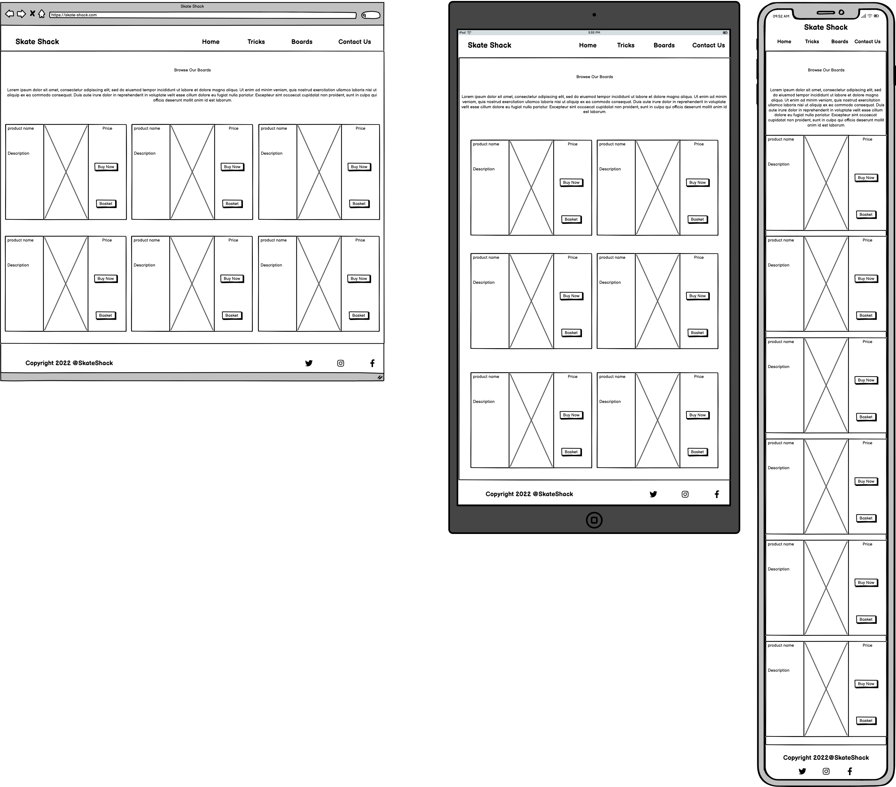

# Skate Shack
(Developer: Jarrad Baker)

[Live webpage](https://jarradbaker.github.io/CI_PP1_SkateShack/)

## Table Of Contents

1. [Project Goals](#project-goals)
  1. [User Goals](#user-goals)
  2. [Website Owner Goals](#website-owner-goals)
2. [User Experience](#user-experience)
    1. [Target Audience](#target-audience)
    2. [User Requrements and Expectations](#user-requirements-and-expectations)
    3. [User Stories](#user-stories)
3. [Design](#design)
    1. [Design Choices](#design-choices)
    2. [Colour](#colour)
    3. [Fonts](#fonts)
    4. [Structure](#structure)
    5. [Wireframes](#wireframes)
4. [Technologies Used](#technologies-used)
    1. [Languages](#languages)
    2. [Frameworks and Tools](#frameworks-and-tools)
5. [Features](#features)
6. [Testing](#validation)
    1. [HTML Validation](#HTML-validation)
    2. [CSS Validation](#CSS-validation)
    3. [Accessibility](#accessibility)
    4. [Performance](#performance)
    5. [Device testing](#performing-tests-on-various-devices)
    6. [Browser compatibility](#browser-compatability)
    7. [Testing user stories](#testing-user-stories)
8. [Bugs](#Bugs)
9. [Deployment](#deployment)
10. [Credits](#credits)
11. [Acknowledgements](#acknowledgements)

## Project Goals

### User Goals
- Find good quality skateboards
- See examples of pricing for the products
- Learn more about skateboarding
- Find the location of the store
- Learn what makes this company different
- Learn how to use skateboards

### Website Owner Goals
- Reach the target audience
- Increase the traffic and sales
- Direct interaction with customers
- Show what makes this company different

## User Experience

### Target Audience
The website is designed with the following target audience in mind:
- Skateboarders looking to buy a new board
- People looking to get in to skateboarding
- Physical skating shops looking for stock
- Skateboarders looking to learn new tricks

### User Requirements and Expectations
- Simplistic user interface
- Smooth Navigation System
- Easy to find relevant information
- All social links direct to the correct website
- Presentation of content is clear
- Visually appealing design
- Accessibility
- Media and functions work as expected

### User Stories

#### First Time User
1. As a first time user, I want to understand the product
2. As a first time user, I want to learn about the company
3. As a first time user, I want to know how much the product costs
4. As a first time user, I want to learn more about skateboarding
5. As a first time user, I want to learn how to use the product
6. As a first time user, I want to ask questions about my order
7. As a first time user, I want to know why to choose this company
8. As a first time user, I want to be able to navigate the site easily

#### Returning User
9. As a returning user, I want to be able to contact the company
10. As a returning user, I want to learn more tricks
11. As a returning user, I want to learn where a physical store is
12. As a returning user, I want to look at products

#### Site Owner
13. As a site owner, I want users to find out about our products
14. As a site owner, I want users to know where our store is
15. As a site owner, I want users to be able to see a 404 page if anything goes wrong
16. As a site owner, I want to enrich our users' skateboarding experience

## Design

### Design Choices
The website was designed to give a "street" feel to the users, which is why a colder colour theme was used. The images of products and skateboarding were used to engage the users.

### Colour
Colour was a very important aspect for engaging with the audience, as anything too childish, or bright may put visitors off. For this reason, I chose to use a nice cold themed colour set for the website, providing a "street" feel. For accessibility reasons, the colours were tested on Webaim using their contrast checker, and the darkest and lightest colours got a contrast ratio of 12.78:1 meaning that they were a great fit.

### Fonts
The chosen font for the website was "Quicksand", with sans serif as a backup font. I originally also used "Lobster" for headings, but I found that "Quicksand" fitted in much better for my target audience and the feel of the site, so I used a higher weight for the headings to make it appear bolder.

### Structure
To keep the user interface as beginner friendly, and simple as possible, I went for a classic looking nav bar style. It is a simple layout with the logo to the left on desktops, and above on mobile. The theme remains the same throughout all four pages:
- Index page: Shows an image of a skateboarder and why you would choose the company. Also contains the history of the company.
- Tricks page: Gives explanations of how to perform various tricks, enriching the users skateboarding experience. Also has a video for each trick.
- Boards page: Allows the users to see the products that are available.
- Contact page: Gives users a chance to communicate with the company, and also shows a real map displaying where the physical store is.

### Wireframes

Home

  

Tricks

  

Boards

  

Contact

  

404

  

## Technologies Used

### Languages
The following languages were used to develop the website:
- HTML
- CSS

### Frameworks and Tools
The following frameworks and tools were used to develop the website:
- Git
- Github
- Gitpod
- Google Fonts
- Font Awesome
- Balsamiq
- Favicon.io

## Features
The website contains 5 pages including the 404 page, and a total of 13 features

### Header (logo and navigation)
- Shows on every page
- The nav links stack under the logo on smaller screens making it responsive
- Enables easy and smooth navigation
- The current page is highlighted in blue
- User Stories:

### Footer
- Shows on every page like the header
- Like the header, the social links also stack underneath the copyright text on smaller screens
- User Stories:

### Tricks
- Shows users explanations as well as videos on how to do tricks, enhancing their exoperience.
- Has an introduction, and an outro
- User Stories:

### Trick videos
- Part of the tricks page
- Has a video with controls explaining how to do the trick
- User Stories:

### Hero Image
- Makes the website more appealing and professional looking
- Connects with the target audience
- User Stories:

### Why Choose Us?
- Explains how the site differs from competitors
- Provides users more info about the products
- User Stories:

### History
- Gives the user an explanation of the company/website
- Tells the personal story of the companies creation
- User Stories:

### Boards
- Allows users to see all products available
- Located on the Boards page
- User Stories:

### Products
- Shows the user the individual info for each product
- Allows them to purchase the item
- Located on the boards page
- User Stories:

### Contact form
- Allows users to contact the site owner/company
- Can be used to chase up an order
- Located on the contact page
- User Stories:

### Google Map
- Shows the location of the physical store on a google maps window
- Located on the contact page
- User Stories:

### Address
- Provides the physical store location
- Located above the google map
- User Stories:

### 404 page
- Redirects the user to a working page
- Explains what the issue is
- User Stories:
